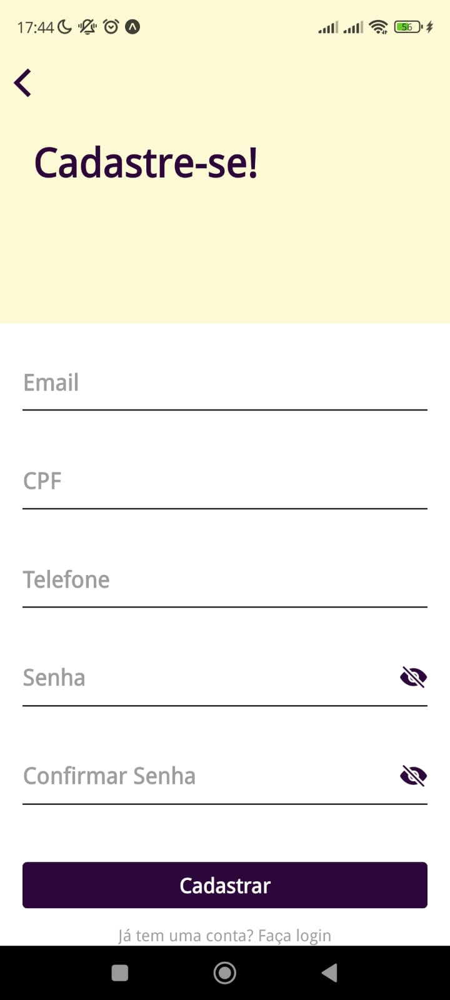
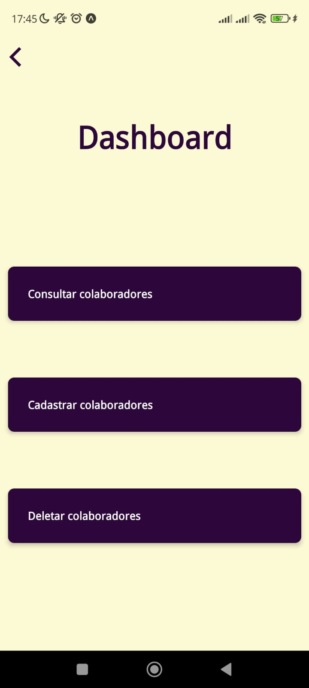
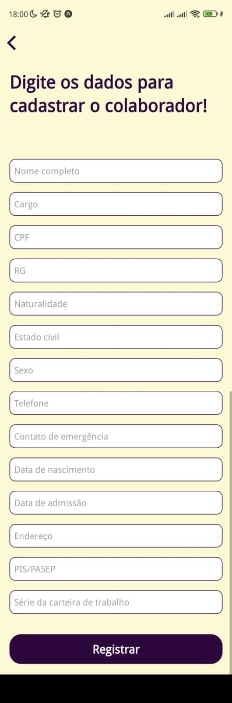
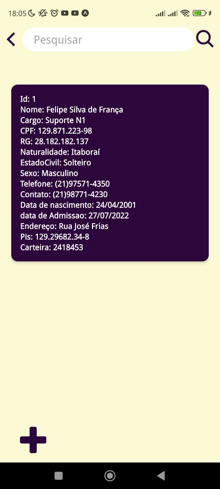

# Control-ID

Projeto de aplicativo em React Native para cadastrar e armazenar dados dos funcionários de uma empresa usando banco de dados SQLite.
Realizado na disciplina de Programação para dispositivos móveis em Android.
Nesse projeto foram utilizadas as bibliotecas React Hook Form, React Native Animatable, IonIcons, MaterialIcons, React Navigation

  
  
  

  
  
  

  

